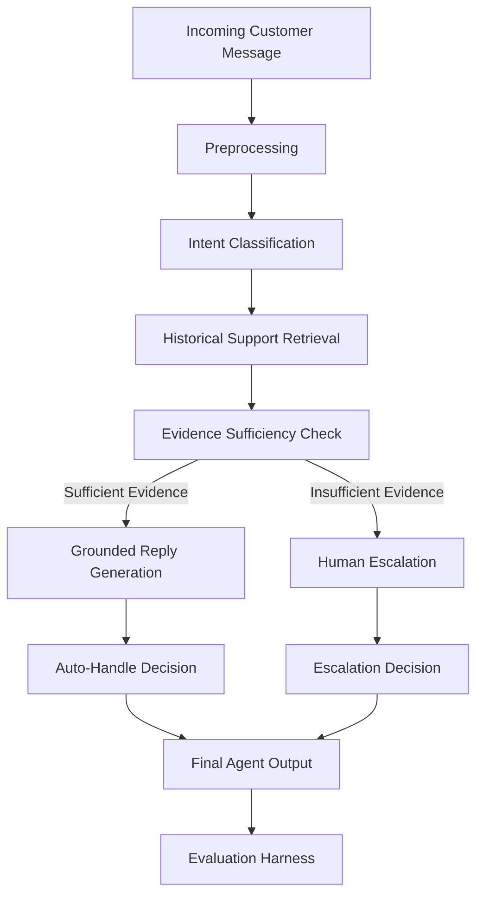

# Hiver AI Support Agent

An evaluation-first AI customer-support agent grounded in historical support conversations.

> **Current Status:** Phase 1 — Project foundation: IN PROGRESS
> This document describes the project plan. No ML model, LLM, retrieval system, or evaluation results have been implemented yet.

---

## Problem

Given an incoming customer-support message, the system will:

```
Customer message
  → Intent classification
    → Historical evidence retrieval
      → Grounded reply generation
        → Auto-handle vs human escalation decision
```

The goal is not merely to produce a convincing chatbot, but to determine whether the agent is trustworthy enough to handle real customer-support messages autonomously.

---

## Assignment Objectives

### Core Agent Capabilities

1. **Intent Classification** — Classify incoming messages into a small set of intents derived from the selected brand's actual support data.
2. **Historically Grounded Reply Drafting** — Draft replies that are grounded in how the brand historically resolved similar issues.
3. **Human Escalation Decision** — Decide whether the message should be auto-handled or escalated to a human, with a stated reason.

### Evaluation Requirements

- Build a golden evaluation set of 150–250 hand-labelled examples.
- Build an evaluation harness with automated metrics and an LLM-as-judge for reply quality.
- Measure LLM judge agreement with human evaluation.
- Compare against at least two baselines: one trivial, one simple.
- Perform failure analysis with top five failure modes and real examples.
- Explain what is misleading about the headline metric.
- Document what should be done with one additional week.

---

## Planned Architecture

> **Note:** All components below are planned and not yet implemented.



### Component Status

| Component | Status |
|-----------|--------|
| Preprocessing | PLANNED |
| Intent Classification | PLANNED |
| Historical Support Retrieval | PLANNED |
| Evidence Sufficiency Check | PLANNED |
| Grounded Reply Generation | PLANNED |
| Escalation Decision | PLANNED |
| Evaluation Harness | PLANNED |

---

## Evaluation Philosophy

This project is **evaluation-first**. The primary objective is not to build the most sophisticated system, but to build a system whose behavior we can measure, understand, and trust.

Every component will be evaluated independently and as part of the full pipeline. We prioritize honest measurement over impressive-looking headlines.

---

## Planned Metrics

> **Note:** No metrics have been computed yet. These are the metrics we plan to use.

### Intent Classification

- Accuracy
- Macro F1
- Per-intent precision / recall / F1
- Confusion matrix

### Retrieval

- Recall@K (K = 1, 3, 5, 10)
- MRR (Mean Reciprocal Rank)

### Reply Quality

- Groundedness (is the reply supported by retrieved evidence?)
- Relevance (does the reply address the customer's issue?)
- Correctness (is the reply factually accurate?)
- Helpfulness (does the reply actually help the customer?)
- Brand / style consistency (does the reply match the brand's tone?)

### Escalation

- Precision
- Recall
- F1
- False auto-handle rate (missed escalations)
- False escalation rate (unnecessary escalations)

---

## Baselines

> **Note:** No baselines have been implemented yet.

### Baseline 1 — Trivial

- Majority-class intent prediction
- Generic support response (e.g., "Thanks for reaching out! We'll look into this.")
- Simple escalation strategy (escalate everything)

### Baseline 2 — Simple

- TF-IDF + Logistic Regression for intent classification
- TF-IDF cosine similarity for retrieval
- Rule-based escalation (escalate if low confidence)

---

## Golden Evaluation Set

The project will create a **150–250 example hand-labelled golden evaluation set**.

Key properties:
- Sampled separately from training data
- Conversation-level separation to reduce leakage
- Independently labelled for reliable evaluation
- **Not created in Phase 1**

---

## Reproducibility Goal

> "Final headline results should be reproducible from a clean environment in under 15 minutes using a documented command."

This goal has not yet been achieved. It will be validated after the full pipeline is implemented.

---

## Scope — What We Will NOT Build

The following are **intentionally excluded** from this project:

- No real Twitter API integration
- No autonomous customer-account actions (e.g., issuing refunds)
- No payment / refund execution
- No production CRM integration
- No attempt to process the full ~3M tweet dataset locally
- No unnecessary authentication system
- No large frontend before the evaluation pipeline is validated

**Rationale:** The assignment focuses on demonstrating a trustworthy support-agent pipeline. Building a production UI or processing the full dataset does not contribute to that goal.

---

## Project Structure

```
hiver-ai-support-agent/
├── app/                    # Application entry points
├── configs/                # Project configuration
├── data/
│   ├── raw/                # Raw downloaded dataset
│   ├── interim/            # Intermediate processing outputs
│   ├── processed/          # Clean, ready-to-use data
│   └── golden/             # Hand-labelled evaluation set
├── evaluation/
│   ├── baselines/          # Baseline implementations
│   ├── metrics/            # Metric computation code
│   ├── judge/              # LLM-as-judge implementation
│   └── human_agreement/    # Human-LLM judge agreement analysis
├── experiments/            # Experiment tracking
├── notebooks/              # Exploratory analysis notebooks
├── reports/                # Generated reports and plots
├── scripts/                # Utility scripts
├── src/
│   ├── data/               # Data loading and sampling
│   ├── preprocessing/      # Text preprocessing
│   ├── intents/            # Intent classification
│   ├── retrieval/          # Historical support retrieval
│   ├── generation/         # Reply generation
│   ├── escalation/         # Escalation decision logic
│   └── agent/              # Full agent orchestration
├── tests/                  # Test suite
├── docs/                   # Documentation
├── .env.example            # Environment variable template
├── .gitignore              # Git ignore rules
├── DECISION_LOG.md         # Engineering decisions log
├── requirements.txt        # Python dependencies
└── run_pipeline.py         # Main entry point
```

---

## Quick Start

```bash
# 1. Clone the repository
git clone <repo-url>
cd hiver-ai-support-agent

# 2. Create virtual environment
python -m venv .venv
source .venv/bin/activate  # Windows: .venv\Scripts\activate

# 3. Install dependencies
pip install -r requirements.txt

# 4. Copy environment variables
cp .env.example .env
# Edit .env with your API keys

# 5. Run the pipeline (Phase 1 only prints foundation info)
python run_pipeline.py
```

---

## License

Internal assignment project — not for distribution.
