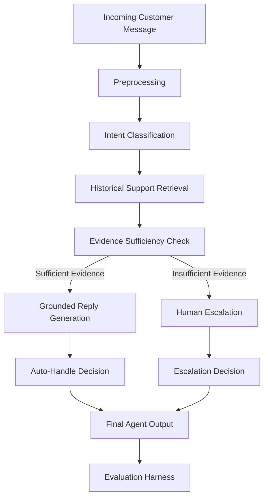

# Hiver AI Support Agent

An evaluation-first AI customer-support agent grounded in historical support conversations.

> **Current Status:** Phase 7 — Intent Classification Baselines: IN PROGRESS
> Phases 1-6 are complete. No LLM, RAG, vector database, reply generation, or escalation has been implemented yet.

---

## Problem

Given an incoming customer-support message, the system will:

```
Customer message
  → Intent classification
    → Historical evidence retrieval
      → Grounded reply generation
        → Auto-handle vs human escalation decision
```

The goal is not merely to produce a convincing chatbot, but to determine whether the agent is trustworthy enough to handle real customer-support messages autonomously.

---

## Dataset

### Customer Support on Twitter

**Source:** Kaggle — `thoughtvector/customer-support-on-twitter`
**URL:** https://www.kaggle.com/datasets/thoughtvector/customer-support-on-twitter

### Why this dataset

It contains real customer-support interactions and multi-turn conversations suitable for building the required support agent. The dataset includes tweets directed at various brands, along with the brands' responses, representing authentic support scenarios.

### Download instructions

**Option A: Kaggle API (automated)**

```bash
# 1. Install Kaggle CLI
pip install kaggle

# 2. Set up credentials
#    Go to: https://www.kaggle.com/settings/account
#    Create API token and set environment variables:
export KAGGLE_USERNAME=your_username
export KAGGLE_KEY=your_api_key

# 3. Run download script
python scripts/download_dataset.py --method kaggle
```

**Option B: Manual download**

1. Go to: https://www.kaggle.com/datasets/thoughtvector/customer-support-on-twitter
2. Click "Download" (free Kaggle account required)
3. Extract the ZIP file
4. Copy CSV file(s) into `data/raw/`
5. Verify: `python scripts/download_dataset.py --verify-only`

**Important:** Raw dataset files are not committed to GitHub.

---

## Inspection

After downloading the dataset, inspect its structure:

```bash
python scripts/inspect_dataset.py
```

This will report file sizes, row/column counts, column names, missing values, and sample records.

---

## Create development sample

Create a reproducible subsample for development:

```bash
python scripts/create_subsample.py --target-messages 25000 --seed 42
```

This creates `data/interim/development_sample.csv` with conversation-level integrity preserved.

---

## Validation

Run validation checks on the dataset:

```bash
python scripts/validate_dataset.py
```

---

## Phase 3 — Exploratory Data Analysis

### Run the EDA notebook

```bash
# From the project root
jupyter notebook notebooks/02_exploratory_data_analysis.ipynb
```

Or execute non-interactively:

```bash
jupyter nbconvert --to notebook --execute notebooks/02_exploratory_data_analysis.ipynb
```

### Run conversation integrity analysis

```bash
python scripts/analyze_conversation_integrity.py
```

### Generated outputs

- `data/interim/eda_statistics.json` — EDA statistics
- `reports/phase_3_eda.md` — EDA report
- `data/interim/conversation_integrity.json` — Integrity check results

### Important findings

- EDA is performed before brand selection to ensure informed decisions.
- Resolution signals are heuristics, not ground-truth labels.
- Noisy social-media text is preserved for analysis, not aggressively cleaned.
- Response times are exploratory, not SLAs.

### Limitations

- No explicit resolution labels in the dataset.
- Language distribution may not be directly available.
- Historical response times should not be interpreted as current performance.

---

## Phase 4 — Brand Selection & Problem Framing

### Compute brand statistics and select brand

```bash
python scripts/compute_brand_statistics.py
```

### Extract selected brand data

```bash
python scripts/extract_selected_brand.py
```

### Key outputs

- `data/interim/brand_scores.json` — All brand scores
- `data/interim/brand_selection.json` — Selected brand details
- `data/interim/selected_brand/` — Extracted brand data
- `reports/phase_4_brand_selection.md` — Selection report
- `reports/problem_framing.md` — Problem framing document

### Selection methodology

Brand selection uses a weighted data-suitability score based on:
- Conversation volume (0.20)
- Multi-turn coverage (0.20)
- Support response coverage (0.20)
- Conversation quality (0.15)
- Customer-support density (0.10)
- Issue diversity proxy (0.10)
- Evaluation suitability (0.05)

### Problem framing

The agent will:
1. Classify customer messages into intents
2. Draft replies grounded in historical support behavior
3. Decide whether to auto-handle or escalate to a human

The agent will NOT:
- Execute refunds or payment changes
- Modify customer accounts
- Integrate with real Twitter API
- Process the full 3M-row dataset

---

## Phase 5 — Intent Discovery

### Prepare intent discovery dataset

```bash
python scripts/prepare_intent_discovery.py --sample-size 5000
```

### Run intent discovery notebook

```bash
jupyter notebook notebooks/03_intent_discovery.ipynb
```

### Validate taxonomy

```bash
python scripts/validate_intent_taxonomy.py
```

### Key outputs

- `data/interim/selected_brand/intent_discovery_messages.csv` — Customer messages for discovery
- `data/interim/selected_brand/intent_taxonomy.json` — Intent taxonomy
- `docs/INTENT_LABELING_GUIDE.md` — Labeling guide
- `reports/phase_5_intent_analysis.md` — Intent analysis report

### Labeling policy

- **Primary Intent:** Select the customer's main support request
- **Multi-Intent:** Select the blocking/root-cause issue
- **Ambiguous:** Label as `ambiguous` if intent cannot be determined
- **Out-of-Scope:** Use sparingly (< 5%) for non-support content

---

## Phase 6 — Golden Evaluation Set

### Build candidate pool

```bash
python scripts/build_golden_candidates.py --pool-size 2000
```

### Annotate examples

```bash
python scripts/annotate_golden.py
```

### Audit golden set

```bash
python scripts/audit_golden_set.py
```

### Check for leakage

```bash
python scripts/check_golden_leakage.py
```

### Validate schema

```bash
python scripts/validate_golden_schema.py
```

### Key outputs

- `data/golden/golden_candidates.csv` — Candidate pool for annotation
- `data/golden/golden_set.jsonl` — Annotated golden set
- `data/golden/golden_set_statistics.json` — Audit statistics
- `data/golden/leakage_report.json` — Leakage check results
- `data/golden/metadata.json` — Golden set metadata
- `docs/GOLDEN_SET_ANNOTATION_GUIDE.md` — Annotation guide
- `reports/golden_sampling_methodology.md` — Sampling methodology
- `reports/golden_intent_coverage.md` — Intent coverage report

### Golden set policy

The golden evaluation set is **evaluation-only** and is NOT used for model training or tuning.

---

## Quick Start

```bash
# 1. Clone the repository
git clone <repo-url>
cd hiver-ai-support-agent

# 2. Create virtual environment
python -m venv .venv
source .venv/bin/activate  # Windows: .venv\Scripts\activate

# 3. Install dependencies
pip install -r requirements.txt

# 4. Download dataset (see instructions above)
python scripts/download_dataset.py

# 5. Inspect the dataset
python scripts/inspect_dataset.py

# 6. Create development sample
python scripts/create_subsample.py --target-messages 25000 --seed 42

# 7. Validate
python scripts/validate_dataset.py

# 8. Run the pipeline (Phase 2 only prints foundation info)
python run_pipeline.py
```

---

## Phase 7 — Intent Classification Baselines

### Dataset Splits

TRAIN (70%) / DEV (15%) / TEST (15%) / GOLDEN (external, locked)

### Baselines

**Baseline 1 — Majority Class (Trivial)**
Always predicts the most frequent intent from training data.

**Baseline 2 — TF-IDF + Logistic Regression (Simple)**
TF-IDF vectorization + Logistic Regression with balanced classes.

### Run

```bash
python scripts/create_model_splits.py --seed 42
python scripts/verify_split_isolation.py
python scripts/run_baselines.py
```

### Results

Results are stored in `evaluation/results/`.

### Golden-Set Protection

Golden data is evaluation-only. Do NOT use for training or tuning.

---

## Assignment Objectives

### Core Agent Capabilities

1. **Intent Classification** — Classify incoming messages into a small set of intents derived from the selected brand's actual support data.
2. **Historically Grounded Reply Drafting** — Draft replies that are grounded in how the brand historically resolved similar issues.
3. **Human Escalation Decision** — Decide whether the message should be auto-handled or escalated to a human, with a stated reason.

### Evaluation Requirements

- Build a golden evaluation set of 150–250 hand-labelled examples.
- Build an evaluation harness with automated metrics and an LLM-as-judge for reply quality.
- Measure LLM judge agreement with human evaluation.
- Compare against at least two baselines: one trivial, one simple.
- Perform failure analysis with top five failure modes and real examples.
- Explain what is misleading about the headline metric.
- Document what should be done with one additional week.

---

## Planned Architecture

> **Note:** All components below are planned and not yet implemented.



### Component Status

| Component | Status |
|-----------|--------|
| Project Foundation | COMPLETE (Phase 1) |
| Dataset Acquisition | IN PROGRESS (Phase 2) |
| Preprocessing | PLANNED |
| Intent Classification | PLANNED |
| Historical Support Retrieval | PLANNED |
| Evidence Sufficiency Check | PLANNED |
| Grounded Reply Generation | PLANNED |
| Escalation Decision | PLANNED |
| Evaluation Harness | PLANNED |

---

## Evaluation Philosophy

This project is **evaluation-first**. The primary objective is not to build the most sophisticated system, but to build a system whose behavior we can measure, understand, and trust.

Every component will be evaluated independently and as part of the full pipeline. We prioritize honest measurement over impressive-looking headlines.

---

## Planned Metrics

> **Note:** No metrics have been computed yet. These are the metrics we plan to use.

### Intent Classification

- Accuracy
- Macro F1
- Per-intent precision / recall / F1
- Confusion matrix

### Retrieval

- Recall@K (K = 1, 3, 5, 10)
- MRR (Mean Reciprocal Rank)

### Reply Quality

- Groundedness (is the reply supported by retrieved evidence?)
- Relevance (does the reply address the customer's issue?)
- Correctness (is the reply factually accurate?)
- Helpfulness (does the reply actually help the customer?)
- Brand / style consistency (does the reply match the brand's tone?)

### Escalation

- Precision
- Recall
- F1
- False auto-handle rate (missed escalations)
- False escalation rate (unnecessary escalations)

---

## Baselines

> **Note:** No baselines have been implemented yet.

### Baseline 1 — Trivial

- Majority-class intent prediction
- Generic support response (e.g., "Thanks for reaching out! We'll look into this.")
- Simple escalation strategy (escalate everything)

### Baseline 2 — Simple

- TF-IDF + Logistic Regression for intent classification
- TF-IDF cosine similarity for retrieval
- Rule-based escalation (escalate if low confidence)

---

## Golden Evaluation Set

The project will create a **150–250 example hand-labelled golden evaluation set**.

Key properties:
- Sampled separately from training data
- Conversation-level separation to reduce leakage
- Independently labelled for reliable evaluation
- **Not created yet**

---

## Reproducibility Goal

> "Final headline results should be reproducible from a clean environment in under 15 minutes using a documented command."

This goal has not yet been achieved. It will be validated after the full pipeline is implemented.

---

## Scope — What We Will NOT Build

The following are **intentionally excluded** from this project:

- No real Twitter API integration
- No autonomous customer-account actions (e.g., issuing refunds)
- No payment / refund execution
- No production CRM integration
- No attempt to process the full ~3M tweet dataset locally
- No unnecessary authentication system
- No large frontend before the evaluation pipeline is validated

**Rationale:** The assignment focuses on demonstrating a trustworthy support-agent pipeline. Building a production UI or processing the full dataset does not contribute to that goal.

---

## Project Structure

```
hiver-ai-support-agent/
├── app/                    # Application entry points
├── configs/                # Project configuration
├── data/
│   ├── raw/                # Raw downloaded dataset (not committed)
│   ├── interim/            # Development subsample and inspection outputs
│   ├── processed/          # Clean, ready-to-use data (Phase 3+)
│   └── golden/             # Hand-labelled evaluation set (Phase 4+)
├── evaluation/
│   ├── baselines/          # Baseline implementations
│   ├── metrics/            # Metric computation code
│   ├── judge/              # LLM-as-judge implementation
│   └── human_agreement/    # Human-LLM judge agreement analysis
├── experiments/            # Experiment tracking
├── notebooks/              # Exploratory analysis notebooks
├── reports/                # Generated reports and plots
├── scripts/                # Utility scripts
├── src/
│   ├── data/               # Data loading and sampling
│   ├── preprocessing/      # Text preprocessing
│   ├── intents/            # Intent classification
│   ├── retrieval/          # Historical support retrieval
│   ├── generation/         # Reply generation
│   ├── escalation/         # Escalation decision logic
│   └── agent/              # Full agent orchestration
├── tests/                  # Test suite
├── docs/                   # Documentation
├── .env.example            # Environment variable template
├── .gitignore              # Git ignore rules
├── DECISION_LOG.md         # Engineering decisions log
├── requirements.txt        # Python dependencies
└── run_pipeline.py         # Main entry point
```

---

## License

Internal assignment project — not for distribution.
