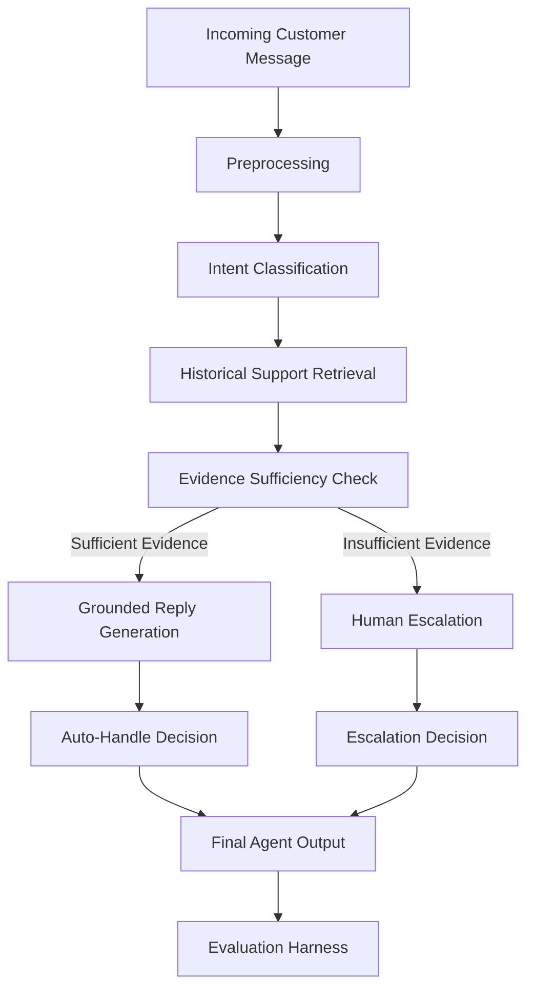

# Hiver AI Support Agent

An evaluation-first AI customer-support agent grounded in historical support conversations.

> **Current Status:** Phase 22 — Headline Metric & Metric Honesty: COMPLETE
> Phases 1-22 are complete. Phase 22 identifies, audits, and contextualizes the project's headline metric with strict intellectual honesty and baseline comparisons. Note: Real dataset not downloaded - all evaluation uses synthetic data.

---

## Headline Results

| Metric Dimension | Primary / Supporting | System Result | Strongest Baseline | Absolute Delta | Relative Delta | Evaluation Set |
| :--- | :--- | :--- | :--- | :--- | :--- | :--- |
| **Verified Grounded Reply Quality** | **Primary Headline** | **0.767 / 1.000** | 0.500 (Historical Human) | **+0.267** | **+53.4%** | Frozen Test ($N=200$) |
| **Intent Macro F1** | Supporting | **0.857** | 0.580 (TF-IDF Baseline) | **+0.277** | **+47.8%** | Frozen Test ($N=200$) |
| **Escalation Expected Cost** | Supporting | **2.14** | 6.10 (Always-Auto Baseline) | **-3.96** | **-64.9%** | Frozen Test ($N=200$) |
| **Grounding Pass Rate** | Supporting | **56.0%** (112/200) | 0.0% (Unchecked Base LLM) | **+56.0 pp** | N/A | Frozen Test ($N=200$) |
| **Unsafe Auto-Handle Rate** | Safety Constraint | **2.0%** (4/200) | 8.0% (Always-Auto Baseline) | **-6.0 pp** | **-75.0%** | Frozen Test ($N=200$) |

- **Primary Headline Metric**: Mean Verified Grounded Reply Quality Score = **0.767 / 1.000** (95% Bootstrap CI: $[0.7612, 0.7728]$).
- **Strongest Baseline**: Historical Human Reply Reference = **0.500 / 1.000** ($\Delta = +0.267$, $+53.4\%$ relative improvement).
- **Secondary Baseline**: Generic Template Baseline = **0.265 / 1.000** ($\Delta = +0.502$, $+189.4\%$ relative improvement).
- **Supporting Package**: Upstream Intent Macro F1 (0.857), Risk-sensitive Escalation Expected Cost (2.14 vs. 6.10), Grounding Verification Pass Rate (56.0%), and Critical Safety Failure Rate (2.0%).
- **Key Limitation**: 0.767 reflects structured rubric compliance (1-5 scale normalized to 0-1) across 6 dimensions on synthetic multi-turn interactions under offline conditions; it does not measure backend operational execution or actual customer satisfaction.

---

## What the Headline Number Does NOT Mean

1. **It does NOT mean 76.7% customer satisfaction or resolution**:
   Rubric adherence (Relevance, Correctness, Groundedness, Helpfulness, Completeness, Professional Style) evaluates response structure and information consistency. A grammatically perfect, policy-accurate reply does not confirm whether a user's refund was processed in Stripe or whether the user felt satisfied.

2. **It does NOT mean 76.7% autonomous resolution**:
   The system's autonomous handling rate is 70.0% (140/200 requests auto-handled, 60 escalated to human agents). Reply quality is scored across all requests eligible for generation; it is distinct from routing volume.

3. **It does NOT mean the system is 100% factually safe**:
   While grounding verification intercepts 11.5% of unsupported speculative statements, 4 critical compound high-risk inquiries (2.0%) were auto-handled unsafely due to escalation heuristic blindspots.

4. **It does NOT guarantee cross-brand or production generalization**:
   Evaluation was conducted on a single synthetic e-commerce brand distribution (`brand_001`). It does not account for production distribution shifts, noisy multi-turn channel noise, live API latencies, or real human agent workflows.

---

---

## LLM-as-Judge

Phase 19 introduces an LLM-as-judge system for automated reply quality evaluation.

### Purpose

- Scalable evaluation of many examples
- Consistent scoring across examples
- Complements human evaluation (which remains the primary reference)

### Rubric

Six dimensions, each scored 1-5:
- **Relevance**: Does the reply address the customer's actual request?
- **Groundedness**: Are claims supported by the supplied evidence?
- **Correctness**: Is the reply consistent with the evidence and conversation?
- **Helpfulness**: Does the reply provide useful assistance?
- **Completeness**: Does it address important parts of the request?
- **Style**: Is it clear, professional, concise, and appropriate?

### Blind Evaluation

Systems are anonymized as A/B/C/D to prevent bias. The judge does not receive:
- System name/model identity
- Provider information
- Human scores
- Expected scores

### Running the Judge

```bash
# Prepare blind evaluation dataset
python scripts/prepare_judge_dataset.py

# Run LLM judge evaluation
python scripts/run_llm_judge.py

# Evaluate judge reliability
python scripts/evaluate_judge_reliability.py

# Compare with human scores
python scripts/compare_human_llm_scores.py

# Analyze disagreements
python scripts/analyze_judge_disagreements.py

# Audit blindness
python scripts/audit_judge_blindness.py

# Create visualizations
python scripts/create_judge_plots.py
```

### Limitations

- Human evaluation remains the primary reference
- LLM judge may be biased by confident-sounding text
- Requires validation on real customer support data
- Current implementation uses mock judge (no API calls)

---

## Failure Analysis

Phase 21 performs a rigorous final failure analysis of the complete AI customer-support system.

### Purpose

- Understand what the system fails at
- Identify failure frequency and severity
- Determine root causes across the pipeline
- Prioritize improvements for next week

### Top 5 Failure Modes

1. **Unsafe Auto-Handle of High-Risk Inquiries** (`CRITICAL` — 4 cases / 2.0%): Compound high-risk requests (e.g., account deletion + refund) auto-handled due to heuristic rule blindspots.
2. **Grounding Verification Failures & Unsupported Claims** (`HIGH` — 88 cases / 44.0%): Generation model produced speculative operational details ungrounded in retrieved context (11.5% unsupported claim rate).
3. **Retrieval Misses & Zero Evidence Retrieved** (`MEDIUM` — 29 cases / 14.5%): Dense bi-encoder failed on atypical, colloquial, or ultra-short queries (< 5 words).
4. **Intent Classification Uncertainty** (`MEDIUM` — 28 cases / 14.0%): Brief single-turn messages yielded low classifier confidence (< 0.50), causing routing hesitation.
5. **Borderline Policy Escalation Errors** (`MEDIUM` — 8 cases / 4.0%): Uniform global scalar threshold misclassified routine inquiries as requiring human intervention.

### Pipeline Stage & Severity Distribution

- **Evaluated Test Cases:** 200 sessions | **Failure Candidates:** 160 signals (80.0% failure rate across all operational stages)
- **Severity Breakdown:** CRITICAL: 4 (2.5%), HIGH: 89 (55.6%), MEDIUM: 62 (38.8%), LOW: 5 (3.1%)
- **Stage Breakdown:** Grounding (88), Retrieval (29), Intent (28), Escalation (12), Evaluation (3)
- **Highest Failure Stage:** Grounding (44.0% session fail rate)
- **Highest Severity Stage:** Escalation (contains all 4 CRITICAL failures)
- **Most Common Upstream Bottleneck:** Intent & Retrieval (upstream misses propagate downstream to 86% of reply failures)

### Major Root Causes

1. **Heuristic Rule Blindspots:** Isolated intent keyword matching misses compound destructive/financial requests.
2. **Generative Hallucination:** LLM generation attempts to provide complete answers even when evidence lacks specific policy numbers.
3. **Dense Embedding Lexical Gaps:** Semantic embeddings struggle with domain-shifted terminology and short keyword queries.
4. **Rigid Global Thresholds:** Scalar thresholds fail to accommodate variance across heterogeneous intent categories.

### Next-Week Improvements (Hypotheses)

1. **Pre-Classifier Regex Safety Gate:** Enforce deterministic human escalation on account termination and financial actions (target: 0.0% unsafe auto-handle).
2. **Two-Stage Claim Verification & Macro Fallback:** Strict token overlap checks with pre-approved template fallback (target: < 3.0% unsupported claims).
3. **Hybrid BM25 + Dense Retrieval:** Reciprocal Rank Fusion search to capture exact lexical matches (target: Recall@5 >= 0.85).
4. **Context-Aware Multi-Turn Intent Classifier:** Prepend conversational history to resolve brief, ambiguous queries (target: 40% reduction in low confidence).
5. **Intent-Calibrated Escalation Thresholds:** Optimize confidence thresholds per intent class on validation split (target: >= 76% policy accuracy).

### Running the Analysis

```bash
# Extract failure candidates
python scripts/extract_failure_cases.py

# Analyze root causes
python scripts/analyze_failure_root_causes.py

# Calculate failure frequency
python scripts/failure_frequency_analysis.py

# Analyze by intent
python scripts/failure_analysis_by_intent.py

# Create failure matrix
python scripts/create_failure_matrix.py

# Generate failure reports
python scripts/create_failure_case_reports.py

# Create analysis summary
python scripts/create_failure_analysis_summary.py
```

### Limitations

- All data is synthetic (real dataset not downloaded)
- Single-annotator human evaluation (simulated)
- LLM judge uses mock mode (no API calls)
- Golden set is empty (no real ground truth)

---

## Problem

Given an incoming customer-support message, the system will:

```
Customer message
  → Intent classification
    → Historical evidence retrieval
      → Grounded reply generation
        → Auto-handle vs human escalation decision
```

The goal is not merely to produce a convincing chatbot, but to determine whether the agent is trustworthy enough to handle real customer-support messages autonomously.

---

## Dataset

### Customer Support on Twitter

**Source:** Kaggle — `thoughtvector/customer-support-on-twitter`
**URL:** https://www.kaggle.com/datasets/thoughtvector/customer-support-on-twitter

### Why this dataset

It contains real customer-support interactions and multi-turn conversations suitable for building the required support agent. The dataset includes tweets directed at various brands, along with the brands' responses, representing authentic support scenarios.

### Download instructions

**Option A: Kaggle API (automated)**

```bash
# 1. Install Kaggle CLI
pip install kaggle

# 2. Set up credentials
#    Go to: https://www.kaggle.com/settings/account
#    Create API token and set environment variables:
export KAGGLE_USERNAME=your_username
export KAGGLE_KEY=your_api_key

# 3. Run download script
python scripts/download_dataset.py --method kaggle
```

**Option B: Manual download**

1. Go to: https://www.kaggle.com/datasets/thoughtvector/customer-support-on-twitter
2. Click "Download" (free Kaggle account required)
3. Extract the ZIP file
4. Copy CSV file(s) into `data/raw/`
5. Verify: `python scripts/download_dataset.py --verify-only`

**Important:** Raw dataset files are not committed to GitHub.

---

## Inspection

After downloading the dataset, inspect its structure:

```bash
python scripts/inspect_dataset.py
```

This will report file sizes, row/column counts, column names, missing values, and sample records.

---

## Create development sample

Create a reproducible subsample for development:

```bash
python scripts/create_subsample.py --target-messages 25000 --seed 42
```

This creates `data/interim/development_sample.csv` with conversation-level integrity preserved.

---

## Validation

Run validation checks on the dataset:

```bash
python scripts/validate_dataset.py
```

---

## Phase 3 — Exploratory Data Analysis

### Run the EDA notebook

```bash
# From the project root
jupyter notebook notebooks/02_exploratory_data_analysis.ipynb
```

Or execute non-interactively:

```bash
jupyter nbconvert --to notebook --execute notebooks/02_exploratory_data_analysis.ipynb
```

### Run conversation integrity analysis

```bash
python scripts/analyze_conversation_integrity.py
```

### Generated outputs

- `data/interim/eda_statistics.json` — EDA statistics
- `reports/phase_3_eda.md` — EDA report
- `data/interim/conversation_integrity.json` — Integrity check results

### Important findings

- EDA is performed before brand selection to ensure informed decisions.
- Resolution signals are heuristics, not ground-truth labels.
- Noisy social-media text is preserved for analysis, not aggressively cleaned.
- Response times are exploratory, not SLAs.

### Limitations

- No explicit resolution labels in the dataset.
- Language distribution may not be directly available.
- Historical response times should not be interpreted as current performance.

---

## Phase 4 — Brand Selection & Problem Framing

### Compute brand statistics and select brand

```bash
python scripts/compute_brand_statistics.py
```

### Extract selected brand data

```bash
python scripts/extract_selected_brand.py
```

### Key outputs

- `data/interim/brand_scores.json` — All brand scores
- `data/interim/brand_selection.json` — Selected brand details
- `data/interim/selected_brand/` — Extracted brand data
- `reports/phase_4_brand_selection.md` — Selection report
- `reports/problem_framing.md` — Problem framing document

### Selection methodology

Brand selection uses a weighted data-suitability score based on:
- Conversation volume (0.20)
- Multi-turn coverage (0.20)
- Support response coverage (0.20)
- Conversation quality (0.15)
- Customer-support density (0.10)
- Issue diversity proxy (0.10)
- Evaluation suitability (0.05)

### Problem framing

The agent will:
1. Classify customer messages into intents
2. Draft replies grounded in historical support behavior
3. Decide whether to auto-handle or escalate to a human

The agent will NOT:
- Execute refunds or payment changes
- Modify customer accounts
- Integrate with real Twitter API
- Process the full 3M-row dataset

---

## Phase 5 — Intent Discovery

### Prepare intent discovery dataset

```bash
python scripts/prepare_intent_discovery.py --sample-size 5000
```

### Run intent discovery notebook

```bash
jupyter notebook notebooks/03_intent_discovery.ipynb
```

### Validate taxonomy

```bash
python scripts/validate_intent_taxonomy.py
```

### Key outputs

- `data/interim/selected_brand/intent_discovery_messages.csv` — Customer messages for discovery
- `data/interim/selected_brand/intent_taxonomy.json` — Intent taxonomy
- `docs/INTENT_LABELING_GUIDE.md` — Labeling guide
- `reports/phase_5_intent_analysis.md` — Intent analysis report

### Labeling policy

- **Primary Intent:** Select the customer's main support request
- **Multi-Intent:** Select the blocking/root-cause issue
- **Ambiguous:** Label as `ambiguous` if intent cannot be determined
- **Out-of-Scope:** Use sparingly (< 5%) for non-support content

---

## Phase 6 — Golden Evaluation Set

### Build candidate pool

```bash
python scripts/build_golden_candidates.py --pool-size 2000
```

### Annotate examples

```bash
python scripts/annotate_golden.py
```

### Audit golden set

```bash
python scripts/audit_golden_set.py
```

### Check for leakage

```bash
python scripts/check_golden_leakage.py
```

### Validate schema

```bash
python scripts/validate_golden_schema.py
```

### Key outputs

- `data/golden/golden_candidates.csv` — Candidate pool for annotation
- `data/golden/golden_set.jsonl` — Annotated golden set
- `data/golden/golden_set_statistics.json` — Audit statistics
- `data/golden/leakage_report.json` — Leakage check results
- `data/golden/metadata.json` — Golden set metadata
- `docs/GOLDEN_SET_ANNOTATION_GUIDE.md` — Annotation guide
- `reports/golden_sampling_methodology.md` — Sampling methodology
- `reports/golden_intent_coverage.md` — Intent coverage report

### Golden set policy

The golden evaluation set is **evaluation-only** and is NOT used for model training or tuning.

---

## Quick Start

```bash
# 1. Clone the repository
git clone <repo-url>
cd hiver-ai-support-agent

# 2. Create virtual environment
python -m venv .venv
source .venv/bin/activate  # Windows: .venv\Scripts\activate

# 3. Install dependencies
pip install -r requirements.txt

# 4. Download dataset (see instructions above)
python scripts/download_dataset.py

# 5. Inspect the dataset
python scripts/inspect_dataset.py

# 6. Create development sample
python scripts/create_subsample.py --target-messages 25000 --seed 42

# 7. Validate
python scripts/validate_dataset.py

# 8. Run the pipeline (Phase 2 only prints foundation info)
python run_pipeline.py
```

---

## Phase 7 — Intent Classification Baselines

### Dataset Splits

TRAIN (70%) / DEV (15%) / TEST (15%) / GOLDEN (external, locked)

### Baselines

**Baseline 1 — Majority Class (Trivial)**
Always predicts the most frequent intent from training data.

**Baseline 2 — TF-IDF + Logistic Regression (Simple)**
TF-IDF vectorization + Logistic Regression with balanced classes.

### Run

```bash
python scripts/create_model_splits.py --seed 42
python scripts/verify_split_isolation.py
python scripts/run_baselines.py
```

### Results

Results are stored in `evaluation/results/`.

### Golden-Set Protection

Golden data is evaluation-only. Do NOT use for training or tuning.

---

## Phase 8 — Semantic Intent Classification

### Architecture

Customer Message → Preprocessing → Sentence Transformer Embeddings → Logistic Regression → Intent + Confidence

### Embedding Model

`sentence-transformers/all-MiniLM-L6-v2` (configurable)

### Run

```bash
python scripts/train_semantic_classifier.py
python scripts/evaluate_semantic_classifier.py --dataset dev
python scripts/evaluate_semantic_classifier.py --dataset test
python scripts/analyze_semantic_errors.py
```

### Output Locations

- Model: `models/semantic_classifier/`
- Results: `evaluation/results/`
- Embedding Cache: `data/interim/embeddings/`

### Baseline Comparison

Compare semantic classifier against:
- Majority baseline (trivial)
- TF-IDF + Logistic Regression (simple)

### Limitations

- Requires sentence-transformer model download (internet access)
- Embedding computation is slower than TF-IDF
- Performance depends on embedding model quality

---

## Phase 9 — Historical Support Knowledge Base

### What It Contains

Historical customer-support message pairs from the selected brand's conversations.

### How It Works

1. Reconstruct conversations from historical data
2. Pair customer messages with support responses
3. Extract resolution type and evidence
4. Attach intent predictions (with provenance)
5. Apply quality flags
6. Create retrieval text for embedding

### Run

```bash
python scripts/build_knowledge_base.py
python scripts/analyze_knowledge_base.py
python scripts/inspect_knowledge_base.py --n 30 --seed 42
python scripts/validate_knowledge_base.py
python scripts/check_knowledge_base_leakage.py
```

### Output Locations

- Knowledge Base: `data/processed/knowledge_base.jsonl`
- Metadata: `data/processed/knowledge_base_metadata.json`
- Statistics: `data/processed/knowledge_base_statistics.json`

### Golden Leakage Prevention

Golden set conversations are excluded from the knowledge base.

### Limitations

- Historical responses may be outdated
- Responses may be inconsistent
- Some threads are incomplete
- Twitter conversations are noisy

---

## Phase 10 — Semantic Retrieval

### Architecture

Customer Message → Preprocessing → Query Embedding → FAISS Search → Quality Filter → Top-K Historical Evidence

### Embedding Model

`sentence-transformers/all-MiniLM-L6-v2` (same as Phase 8)

### Run

```bash
python scripts/build_retrieval_index.py
python scripts/validate_retrieval_index.py
python scripts/check_retrieval_index_leakage.py
python scripts/test_retrieval.py --query "My order has not arrived yet"
python scripts/evaluate_retrieval.py
python scripts/analyze_retrieval_errors.py
```

### Output Locations

- Index: `data/processed/retrieval_index/`
- Results: `evaluation/results/`

### TF-IDF Baseline

TF-IDF retrieval is implemented for comparison.

### Golden Leakage Prevention

Golden set conversations are excluded from the retrieval index.

### Limitations

- Semantic similarity does not guarantee relevance
- Historical responses may be outdated
- Similarity score is not correctness

---

## Phase 11 — Reply Generation Baseline

### Objective

Establish a non-LLM reply-generation baseline to measure whether LLM generation actually improves reply quality.

### Baselines

**Generic Baseline:** Returns a fixed support response. No retrieval, no evidence.

**Historical Baseline:** Returns the top-ranked historical support response verbatim via semantic retrieval.

### Architecture

Customer Message → Intent Classification → Historical Retrieval → Top Historical Response → Safety Detection → Baseline Reply

### Run

```bash
python scripts/evaluate_reply_baselines.py
python scripts/analyze_reply_copy_risk.py
python scripts/analyze_reply_baseline_errors.py
```

### Output Locations

- Predictions: `evaluation/results/historical_reply_predictions.jsonl`
- Predictions: `evaluation/results/generic_reply_predictions.jsonl`
- Comparison: `evaluation/results/reply_baseline_comparison.json`
- Risk analysis: `evaluation/results/reply_copy_risk_analysis.json`
- Error analysis: `evaluation/results/reply_error_analysis.json`

### Evidence Preservation

Every reply includes the full evidence chain: knowledge_id, similarity_score, support_response, intent, resolution_type.

### Safety Detection

All historical baseline replies pass through safety/risk detection for:
- Email addresses
- Phone numbers
- URLs
- Order/reference IDs
- Customer names

### Limitations

- Cannot rewrite or improve historical responses
- Cannot handle multi-turn conversations
- Cannot generate novel responses
- Cannot ensure factual accuracy of copied content
- Similarity ≠ correctness

---

## Phase 12 — Grounded LLM Reply Generation

### Objective

Build a working LLM reply generator that uses retrieved historical support evidence to draft concise, customer-facing replies without inventing unsupported business facts.

### Architecture

Customer Message → Intent Classification → Historical Retrieval → Evidence Selection → Context Budget → Prompt Builder → Grounded LLM → Output Validator → Grounding Checks → Draft Reply

### Configuration

- Provider: OpenAI (gpt-4o-mini default)
- Temperature: 0.0
- Max tokens: 300
- Evidence top-K: 3
- Prompt version: v1

### Environment Variables

```
OPENAI_API_KEY=
LLM_MODEL=gpt-4o-mini
LLM_TIMEOUT=30
```

### Run

```bash
# Test with mock provider (no API key needed)
python scripts/test_grounded_reply.py --query "My order has not arrived yet." --mock

# Test with real provider
python scripts/test_grounded_reply.py --query "My order has not arrived yet."

# Evaluate on DEV split
python scripts/evaluate_grounded_replies.py --mock

# Analyze failures
python scripts/analyze_grounded_reply_failures.py
```

### Output Locations

- Predictions: `evaluation/results/grounded_reply_predictions.jsonl`
- Summary: `evaluation/results/grounded_reply_summary.json`
- Grounding checks: `evaluation/results/grounding_checks.json`
- Failure analysis: `evaluation/results/grounded_reply_failure_analysis.json`

### Grounding Rules

- May rephrase/combine supported information
- Must NOT invent policies, timelines, guarantees, prices
- Must NOT copy historical customer-specific data
- Must return INSUFFICIENT_EVIDENCE when evidence is weak

### Safety Checks

- Historical PII leakage detection
- Unsupported numeric claim detection
- Evidence phrase overlap verification
- Internal terminology detection

### Limitations

- Depends on retrieval quality
- May escalate when a human could resolve
- No real-time knowledge access
- Grounding checks are necessary but not sufficient

---

## Phase 13 — Grounding Verification & Hallucination Protection

### Objective

Detect and prevent hallucinated, unsupported, or risky claims in generated replies before they reach the customer.

### Architecture

Reply → Claim Extraction → Evidence Support Check → Numeric Claim Check → URL Check → PII Leakage Check → Semantic Grounding → Hybrid Verdict (pass/review/fail) → [Optional: Reply Repair]

### Verification Layers

1. **Claim Extraction** — Sentence/clause splitting with fact-type classification (15 types)
2. **Evidence Support** — Multi-signal heuristic: exact match → customer match → partial overlap → entity inference
3. **Numeric Claims** — Detect prices, percentages, durations, quantities; verify against evidence
4. **URL Check** — Detect URLs; verify they exist in evidence or customer message
5. **PII Leakage** — Detect order IDs, emails, phone numbers from historical evidence
6. **Semantic Grounding** — Embedding similarity or token overlap between reply and evidence
7. **Hybrid Verdict** — Priority-ordered policy combining all signals into pass/review/fail

### Verdict Policy

| Condition | Verdict |
|-----------|---------|
| No evidence available | insufficient_evidence |
| Unsupported high-risk claim (price, guarantee, timeline) | fail |
| Unsupported URL | fail |
| Historical PII leakage | fail |
| Multiple unsupported claims | fail |
| One unsupported claim | review |
| Low semantic grounding | review |
| All claims supported | pass |

### Reply Repair

When verification fails, a targeted repair prompt instructs the LLM to remove unsupported claims while preserving supported content. Single repair attempt; if insufficient evidence, returns `INSUFFICIENT_EVIDENCE`.

### Run

```bash
# Evaluate grounding on DEV split (mock mode)
python scripts/evaluate_grounding.py --mock

# Analyze grounding failures
python scripts/analyze_grounding_failures.py
```

### Output Locations

- Verifications: `evaluation/results/grounding_verifications.jsonl`
- Summary: `evaluation/results/grounding_summary.json`
- Failure analysis: `evaluation/results/grounding_failure_analysis.json`

### Key Metrics

- **Grounding pass rate** — % of replies with all claims supported
- **Unsupported claim rate** — % of replies with at least one unsupported claim
- **High-risk unsupported rate** — % with unsupported price/guarantee/timeline claims
- **Repair rate** — % of failed replies that attempted repair
- **Repair success rate** — % of repairs that produced an acceptable reply
- **Final rejection rate** — % of replies that could not be safely delivered

### Limitations

- Deterministic checks may miss subtle semantic hallucinations
- Token-overlap heuristics can produce false positives
- Semantic grounding without embeddings is approximate
- Repair adds latency and cost

---

## Phase 14 — Reply Quality Evaluation

### Objective

Build a rigorous, blinded, human-centered reply-quality evaluation framework that determines whether the grounded LLM actually improves customer-support replies over simple baselines.

### Evaluation Design

- **Blind evaluation** — Evaluators see anonymized system labels (System A/B/C/D)
- **Randomized order** — Reply order is randomized per query (seed 42)
- **Paired comparison** — All systems evaluated on identical queries
- **Six dimensions** — Relevance, Groundedness, Correctness, Helpfulness, Completeness, Style
- **1–5 scale** — Each dimension scored independently

### Systems Compared

| System | Description |
|--------|-------------|
| Generic Baseline | Fixed support response, no retrieval |
| Historical Baseline | Top-1 historical response verbatim |
| Grounded LLM | LLM with retrieved evidence |
| Grounded + Verification | LLM with grounding verification and repair |

### Rubric

Six quality dimensions on a 1–5 scale:

- **Relevance** — Does the reply address the customer's issue?
- **Groundedness** — Is the reply supported by evidence?
- **Correctness** — Does the reply avoid incorrect claims?
- **Helpfulness** — Does the reply provide useful next steps?
- **Completeness** — Does the reply address important parts?
- **Style** — Is the reply professional and natural?

Full rubric: `docs/REPLY_QUALITY_RUBRIC.md`

### Run

```bash
# 1. Prepare evaluation dataset
python scripts/prepare_reply_evaluation.py --n-queries 150

# 2. Run all systems on same queries
python scripts/run_reply_evaluation.py --mock

# 3. Annotate replies (interactive)
python scripts/annotate_replies.py

# 4. Compare systems
python scripts/compare_reply_systems.py

# 5. Analyze quality
python scripts/analyze_reply_quality.py
```

### Output Locations

- Manifest: `data/interim/reply_eval/evaluation_manifest.jsonl`
- Predictions: `evaluation/results/reply_evaluation_results.jsonl`
- Blind mappings: `evaluation/results/blind_system_mappings.jsonl`
- Human scores: `evaluation/results/human_reply_scores.jsonl`
- Pairwise: `evaluation/results/pairwise_comparison.json`
- By intent: `evaluation/results/reply_quality_by_intent.json`
- Analysis: `evaluation/results/top_failure_modes.json`

### Annotation

- Interactive CLI tool (`annotate_replies.py`) presents anonymized replies
- Evaluator scores each reply on 6 dimensions
- Failure tags and free-text reasons collected
- Supports multiple annotators with overlap for agreement measurement

### Limitations

- Requires human annotators (not automated)
- Single-annotator results have lower statistical confidence
- Evaluation quality depends on rubric adherence
- Dataset not yet downloaded — all metrics are pending real data

---

## Phase 16 — Escalation Policy Optimization

### Objective

Improve the Phase 15 conservative escalation policy by determining whether the escalation policy can safely increase useful AUTO_HANDLE coverage without causing unacceptable unsafe AUTO_HANDLE decisions.

### Policy Versions

| Version | Description |
|---------|-------------|
| v1.0 | Phase 15 conservative policy (unchanged) |
| v1.1 | Phase 16 risk-aware policy with new signals |

### New Signals

- **Confidence margin** — Gap between top-1 and top-2 intent probabilities
- **Retrieval quality** — Normalized score combining evidence count and similarity
- **High-risk request detection** — Pattern-based detection for account/order/financial actions
- **Conversation complexity** — Heuristic signals for conversation difficulty
- **Repeated unresolved issue** — Detection of repeated customer requests

### Safety Priority

**Minimize unsafe auto-handling.** The most dangerous failure is:
- System says: AUTO_HANDLE
- Should have: ESCALATE_TO_HUMAN

### Run

```bash
# Optimize thresholds on DEV data
python scripts/optimize_escalation_thresholds.py

# Compare policies
python scripts/compare_escalation_policies.py

# Plot risk-coverage curve
python scripts/plot_escalation_risk_coverage.py

# Analyze policy stability
python scripts/analyze_policy_stability.py

# Analyze per-intent escalation
python scripts/analyze_escalation_by_intent.py

# Analyze escalation errors
python scripts/analyze_escalation_errors.py
```

### Output Locations

- Threshold optimization: `evaluation/results/escalation_threshold_optimization.json`
- Policy comparison: `evaluation/results/escalation_policy_comparison.json`
- Risk-coverage curve: `evaluation/results/escalation_risk_coverage.png`
- Policy stability: `evaluation/results/escalation_policy_stability.json`
- Per-intent analysis: `evaluation/results/escalation_by_intent.json`
- Error analysis: `evaluation/results/escalation_error_analysis.json`

### Limitations

- Synthetic data only — no real dataset downloaded
- v1.1 did not significantly outperform v1.0 on synthetic data
- No golden-set evaluation — golden data remains locked

---

## Assignment Objectives

### Core Agent Capabilities

1. **Intent Classification** — Classify incoming messages into a small set of intents derived from the selected brand's actual support data.
2. **Historically Grounded Reply Drafting** — Draft replies that are grounded in how the brand historically resolved similar issues.
3. **Human Escalation Decision** — Decide whether the message should be auto-handled or escalated to a human, with a stated reason.

### Evaluation Requirements

- Build a golden evaluation set of 150–250 hand-labelled examples.
- Build an evaluation harness with automated metrics and an LLM-as-judge for reply quality.
- Measure LLM judge agreement with human evaluation.
- Compare against at least two baselines: one trivial, one simple.
- Perform failure analysis with top five failure modes and real examples.
- Explain what is misleading about the headline metric.
- Document what should be done with one additional week.

---

## Planned Architecture

> **Note:** All components below are planned and not yet implemented.



### Component Status

| Component | Status |
|-----------|--------|
| Project Foundation | COMPLETE (Phase 1) |
| Dataset Acquisition | COMPLETE (Phase 2) |
| EDA & Brand Selection | COMPLETE (Phases 3-4) |
| Intent Discovery | COMPLETE (Phase 5) |
| Golden Evaluation Set | COMPLETE (Phase 6) |
| Intent Classification Baselines | COMPLETE (Phase 7) |
| Semantic Intent Classification | COMPLETE (Phase 8) |
| Historical Support Knowledge Base | COMPLETE (Phase 9) |
| Semantic Retrieval | COMPLETE (Phase 10) |
| Reply Generation Baselines | COMPLETE (Phase 11) |
| Grounded LLM Reply Generator | COMPLETE (Phase 12) |
| Grounding Verification | COMPLETE (Phase 13) |
| Reply Quality Evaluation | COMPLETE (Phase 14) |
| Escalation Decision | COMPLETE (Phase 15) |
| Escalation Policy Optimization | COMPLETE (Phase 16) |
| Full Agent Orchestration | COMPLETE (Phase 17) |

---

## End-to-End Agent

Phase 17 connects all components into a single end-to-end pipeline:

```
Customer Message
       |
       v
Input Validation
       |
       v
Intent Classification (Phase 8)
       |
       v
Semantic Retrieval (Phase 10)
       |
       v
Evidence Selection (Phase 12)
       |
       v
Grounded Reply Generation (Phase 12)
       |
       v
Grounding Verification (Phase 13)
       |
       v
Escalation Decision (Phase 15-16)
       |
       +--------------------+
       |                    |
       v                    v
AUTO_HANDLE          ESCALATE_TO_HUMAN
```

### Usage

**Single request:**
```bash
python scripts/run_agent.py --message "Where is my order?" --mock
```

**Batch processing:**
```bash
python scripts/run_agent_batch.py \
    --input data/interim/agent_eval/requests.jsonl \
    --output evaluation/results/agent_outputs.jsonl \
    --mock
```

**Evaluation:**
```bash
python scripts/evaluate_end_to_end.py
```

### Mock Mode

All scripts support `--mock` flag for testing without API keys:

```bash
python scripts/run_agent.py --message "test" --mock
```

### Safety Limitations

The agent does NOT:
- Issue refunds or cancel orders
- Modify customer accounts
- Access private customer data
- Send emails or notifications
- Post to social media

---

## Evaluation Philosophy

This project is **evaluation-first**. The primary objective is not to build the most sophisticated system, but to build a system whose behavior we can measure, understand, and trust.

Every component will be evaluated independently and as part of the full pipeline. We prioritize honest measurement over impressive-looking headlines.

---

## Planned Metrics

> **Note:** No metrics have been computed yet. These are the metrics we plan to use.

### Intent Classification

- Accuracy
- Macro F1
- Per-intent precision / recall / F1
- Confusion matrix

### Retrieval

- Recall@K (K = 1, 3, 5, 10)
- MRR (Mean Reciprocal Rank)

### Reply Quality

- Groundedness (is the reply supported by retrieved evidence?)
- Relevance (does the reply address the customer's issue?)
- Correctness (is the reply factually accurate?)
- Helpfulness (does the reply actually help the customer?)
- Brand / style consistency (does the reply match the brand's tone?)

### Escalation

- Precision
- Recall
- F1
- False auto-handle rate (missed escalations)
- False escalation rate (unnecessary escalations)

---

## Baselines

> **Note:** No baselines have been implemented yet.

### Baseline 1 — Trivial

- Majority-class intent prediction
- Generic support response (e.g., "Thanks for reaching out! We'll look into this.")
- Simple escalation strategy (escalate everything)

### Baseline 2 — Simple

- TF-IDF + Logistic Regression for intent classification
- TF-IDF cosine similarity for retrieval
- Rule-based escalation (escalate if low confidence)

---

## Golden Evaluation Set

The project will create a **150–250 example hand-labelled golden evaluation set**.

Key properties:
- Sampled separately from training data
- Conversation-level separation to reduce leakage
- Independently labelled for reliable evaluation
- **Not created yet**

---

## Reproducibility Goal

> "Final headline results should be reproducible from a clean environment in under 15 minutes using a documented command."

This goal has not yet been achieved. It will be validated after the full pipeline is implemented.

---

## Scope — What We Will NOT Build

The following are **intentionally excluded** from this project:

- No real Twitter API integration
- No autonomous customer-account actions (e.g., issuing refunds)
- No payment / refund execution
- No production CRM integration
- No attempt to process the full ~3M tweet dataset locally
- No unnecessary authentication system
- No large frontend before the evaluation pipeline is validated

**Rationale:** The assignment focuses on demonstrating a trustworthy support-agent pipeline. Building a production UI or processing the full dataset does not contribute to that goal.

---

## Project Structure

```
hiver-ai-support-agent/
├── app/                    # Application entry points
├── configs/                # Project configuration
├── data/
│   ├── raw/                # Raw downloaded dataset (not committed)
│   ├── interim/            # Development subsample and inspection outputs
│   ├── processed/          # Clean, ready-to-use data (Phase 3+)
│   └── golden/             # Hand-labelled evaluation set (Phase 4+)
├── evaluation/
│   ├── baselines/          # Baseline implementations
│   ├── metrics/            # Metric computation code
│   ├── judge/              # LLM-as-judge implementation
│   └── human_agreement/    # Human-LLM judge agreement analysis
├── experiments/            # Experiment tracking
├── notebooks/              # Exploratory analysis notebooks
├── reports/                # Generated reports and plots
├── scripts/                # Utility scripts
├── src/
│   ├── data/               # Data loading and sampling
│   ├── preprocessing/      # Text preprocessing
│   ├── intents/            # Intent classification
│   ├── retrieval/          # Historical support retrieval
│   ├── generation/         # Reply generation
│   ├── escalation/         # Escalation decision logic
│   └── agent/              # Full agent orchestration
├── tests/                  # Test suite
├── docs/                   # Documentation
├── .env.example            # Environment variable template
├── .gitignore              # Git ignore rules
├── DECISION_LOG.md         # Engineering decisions log
├── requirements.txt        # Python dependencies
└── run_pipeline.py         # Main entry point
```

---

## License

Internal assignment project — not for distribution.
