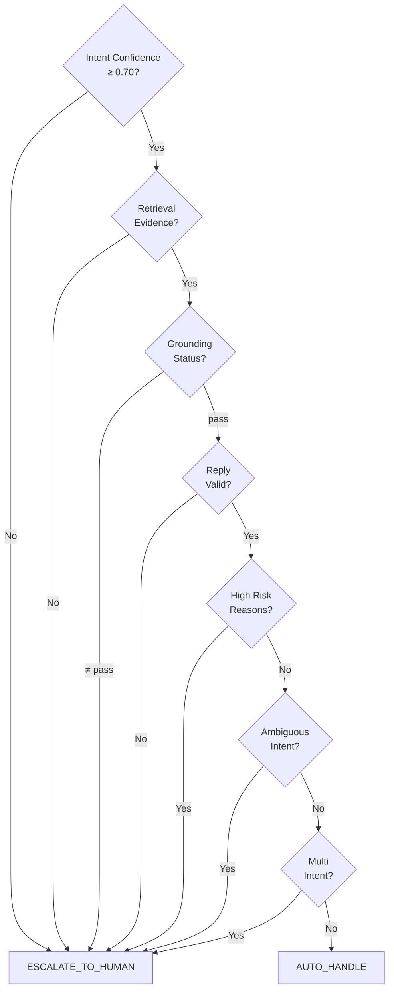

# Escalation Policy v1.0

## Decision Rules

```
AUTO_HANDLE = ALL of:
  - intent_confidence >= 0.70
  - retrieval_evidence available
  - grounding_status = "pass"
  - reply valid
  - no high_risk reasons
  - no ambiguous intent
  - no multi_intent

Otherwise → ESCALATE_TO_HUMAN
```

## Rule Priority

| Priority | Rule | Rationale |
|----------|------|-----------|
| 1 | High-risk reasons always escalate | Safety-critical: billing, personal info, threats, legal |
| 2 | Low intent confidence escalates | Uncertain classification → human judgment |
| 3 | No retrieval evidence escalates | Insufficient knowledge to answer |
| 4 | Grounding failures escalate | Reply contains unsupported claims |
| 5 | Ambiguous intent escalates | Multiple possible interpretations |
| 6 | Multi-intent escalates | Complex query needs decomposition |

## Decision Flow



## Key Safety Metric

**FALSE_AUTO_HANDLE_RATE**: Rate of cases where the system auto-handles but gold label is ESCALATE_TO_HUMAN. Target: <5%. This is the most critical metric — under-escalation risks harm to customers.

## Threshold Tuning

The default minimum intent confidence is 0.70. Adjust via `configs/escalation.yaml`:

```yaml
escalation:
  intent_confidence:
    minimum_auto_handle: 0.70
```

Higher values → more conservative (more escalations).
Lower values → more aggressive (more auto-handles).

## Reason Codes

20 reason codes in 4 categories. See `src/escalation/reason_codes.py` for full definitions.

### High Risk (always escalate)
- `BILLING_CLAIM` — Pricing, charges, refund amounts
- `PERSONAL_INFO` — Account-specific identity claims
- `CANCELLATION_REQUEST` — Subscription/order cancellation
- `REFUND_REQUEST` — Refund or return requests
- `LEGAL_THREATS` — Legal action or complaint threats
- `THREATS_ABUSE` — Threatening or abusive language
- `ACCOUNT_SECURITY` — Security compromise, unauthorized access

### Retrieval
- `RETRIEVAL_LOW_SCORE` — Best evidence similarity <0.3
- `RETRIEVAL_NO_EVIDENCE` — No supporting documents found
- `INSUFFICIENT_CONTEXT` — Context budget too small

### Grounding
- `UNSUPPORTED_CLAIMS` — Reply contains unsupported claims
- `GROUNDING_FAILED` — Grounding verification failed

### Policy
- `LOW_INTENT_CONFIDENCE` — Intent classification uncertain
- `AMBIGUOUS_INTENT` — Multiple intents detected
- `MULTI_INTENT` — Query requires multi-step handling
- `LOW_REPLY_CONFIDENCE` — Reply confidence below threshold
- `MISSING_INSTRUCTION` — Critical step not provided
- `FINANCIAL_CLAIM` — Monetary promise without evidence
- `ACCOUNT_SPECIFIC` — Requires account-level access
- `EMOTIONAL_CUSTOMER` — Frustrated or distressed customer
