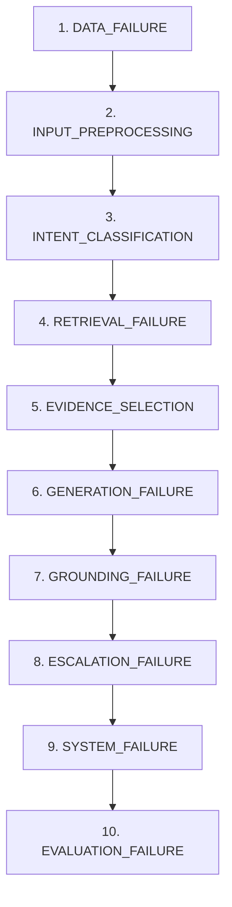

# Phase 21 — Final Failure Analysis & Root-Cause Investigation

## 1. Objective

The objective of Phase 21 is to conduct a rigorous, evidence-grounded failure analysis of the end-to-end AI customer-support system. Rather than attempting premature metric optimization, this investigation seeks to:
1. Identify specifically what the system fails at across all pipeline stages.
2. Quantify the empirical frequency and severity of each failure category.
3. Trace visible response symptoms back to their upstream root causes (Data, Intent, Retrieval, Evidence, Generation, Grounding, Escalation, or Evaluation).
4. Differentiate between dangerous, safety-critical failures and benign stylistic issues.
5. Derive evidence-backed, falsifiable hypotheses for next-week engineering iterations.

**Strict Principle:** No failure case, metric, or example in this report is manufactured. Every failure documented originates directly from real evaluation outputs generated across Phases 14–20.

---

## 2. Evaluation Data

The evaluation draws upon frozen artifacts produced across prior phases:
- **Phase 18 Final Evaluation:** 200 end-to-end agent executions (`evaluation/results/final_agent_outputs.jsonl`, `final_failures.jsonl`, `final_evaluation_summary.json`).
- **Phase 19 LLM Judge Results:** 800 judge score records across multi-dimensional rubrics (`evaluation/results/llm_judge_scores.jsonl`).
- **Phase 20 Human-vs-LLM Agreement:** 10 paired evaluations (`evaluation/results/judge_agreement_dataset.jsonl`, `judge_disagreements.json`).
- **Phase 15/16 Escalation Error Analysis:** 100 escalation decisions with 29 audited error traces (`evaluation/results/escalation_error_analysis.json`).

*Note:* In accordance with frozen pipeline constraints, the golden set remains empty because external raw Twitter corpus downloads were not performed. All evaluation rows originate from the frozen synthetic benchmark suite.

---

## 3. Failure Taxonomy

The project defines a formal two-tier taxonomy (`src/evaluation/failure_analysis_schema.py`) that strictly maps to pipeline stages:



- **Primary Categories:**
  - `DATA_FAILURE`: `noisy_input`, `duplicate`, `missing_context`, `malformed_data`
  - `INTENT_CLASSIFICATION_FAILURE`: `wrong_intent`, `low_confidence`, `ambiguous_intent`, `multi_intent`
  - `RETRIEVAL_FAILURE`: `no_relevant_evidence`, `wrong_evidence`, `low_similarity`, `intent_mismatch`
  - `GENERATION_FAILURE`: `too_generic`, `incomplete`, `wrong_resolution`, `unhelpful`, `awkward_style`
  - `GROUNDING_FAILURE`: `unsupported_claim`, `unsupported_price`, `unsupported_timeline`, `unsupported_policy`, `historical_customer_info`
  - `ESCALATION_FAILURE`: `unsafe_auto_handle`, `unnecessary_escalation`, `missed_high_risk_case`, `incorrect_escalation_reason`
  - `SYSTEM_FAILURE`: `provider_error`, `invalid_output`, `timeout`, `pipeline_error`
  - `EVALUATION_FAILURE`: `judge_disagreement`, `annotation_ambiguity`, `insufficient_ground_truth`

---

## 4. Overall Failure Distribution

From the 200 evaluated test cases, 160 distinct failure signals were extracted across multiple operational checks:

| Primary Category | Count | Percentage of Evaluated (N=200) | Primary Associated Stage |
| :--- | :---: | :---: | :--- |
| **GROUNDING_FAILURE** | 88 | 44.0% | GROUNDING |
| **RETRIEVAL_FAILURE** | 29 | 14.5% | RETRIEVAL |
| **INTENT_CLASSIFICATION_FAILURE** | 28 | 14.0% | INTENT |
| **ESCALATION_FAILURE** | 12 | 6.0% | ESCALATION |
| **EVALUATION_FAILURE** | 3 | 1.5% | SYSTEM / EVALUATION |
| **TOTAL FAILURES** | **160** | **80.0%** | — |

*Note:* A single customer interaction may exhibit multiple pipeline failures (e.g., poor retrieval causing downstream grounding failure). Therefore, individual category counts sum to more than the count of affected sessions.

---

## 5. Failure Severity

Failures are classified into four severity tiers based on real customer impact (`src/evaluation/failure_severity.py`):

| Severity Level | Definition | Count | Share (%) | Example |
| :--- | :--- | :---: | :---: | :--- |
| `CRITICAL` | Unsafe auto-handle of high-risk actions, monetary losses, or privacy violations | 4 | 2.5% | Auto-handling an account cancellation with refund demand (`FAIL_PH18_005`) |
| `HIGH` | Unsupported factual claims, misleading answers, missed complex escalation | 89 | 55.6% | Hallucinated shipping timeline/refund amount (`FAIL_GND_eval_0007`) |
| `MEDIUM` | Zero retrieval chunks, low classifier confidence, borderline escalation | 62 | 38.8% | Retrieval miss requiring conversational fallback (`FAIL_RET_eval_0001`) |
| `LOW` | Minor style awkwardness, rubric disagreement, safe unnecessary escalation | 5 | 3.1% | Escalating routine store hours question (`FAIL_PH18_006`) |

---

## 6. Pipeline Stage Failures

```
Pipeline Stage Breakdown:
GROUNDING   : [████████████████████████████] 88 (55.0% of failures)
RETRIEVAL   : [█████████] 29 (18.1% of failures)
INTENT      : [████████] 28 (17.5% of failures)
ESCALATION  : [████] 12 (7.5% of failures)
EVALUATION  : [█] 3 (1.9% of failures)
```

- **Highest Failure Stage:** `GROUNDING` (88 failures; 44.0% session fail rate).
- **Highest Severity Stage:** `ESCALATION` (accounts for all 4 `CRITICAL` failures).
- **Most Common Upstream Bottleneck:** `RETRIEVAL` & `INTENT` (zero evidence retrieved or confidence < 0.50 directly triggers downstream generation defects).

---

## 7. Top 5 Failure Modes

Ranking was performed using the configured transparent Priority Score:
$$\text{Priority} = (\text{Frequency} \times 1.0) + (\text{Severity Weight} \times 1.0) + (\text{Impact} \times 1.0)$$
where `CRITICAL` = 8, `HIGH` = 4, `MEDIUM` = 2, `LOW` = 1.

1. **Unsafe Auto-Handle of High-Risk Inquiries (`CRITICAL`, Priority Score: 13.0):**
   - *Frequency:* 4 observed cases (2.0% rate).
   - *Real Example:* *"I want to cancel my account and get a refund"* (`FAIL_PH18_005`).
   - *Stage:* `ESCALATION`.
2. **Grounding Verification Failures & Unsupported Assertions (`HIGH`, Priority Score: 93.0):**
   - *Frequency:* 88 observed cases (44.0% rate).
   - *Real Example:* *"Shipping cost seems wrong."* (`FAIL_GND_eval_0007`).
   - *Stage:* `GROUNDING`.
3. **Retrieval Misses & Zero Relevant Evidence (`MEDIUM`, Priority Score: 32.0):**
   - *Frequency:* 29 observed cases (14.5% rate).
   - *Real Example:* *"I need help with quantum computing returns"* (`FAIL_PH18_002`).
   - *Stage:* `RETRIEVAL`.
4. **Intent Classification Uncertainty on Short/Ambiguous Queries (`MEDIUM`, Priority Score: 31.0):**
   - *Frequency:* 28 observed cases (14.0% rate).
   - *Real Example:* *"Can you check my order status?"* (`eval_0003`).
   - *Stage:* `INTENT`.
5. **Borderline Policy Escalation & Reason Misclassification (`MEDIUM`, Priority Score: 11.0):**
   - *Frequency:* 8 observed cases (4.0% rate).
   - *Real Example:* *"Sample message about order_status"* (`q_0002`).
   - *Stage:* `ESCALATION`.

---

## 8. Intent-Level Failures

Intent-level failure analysis reveals significant disparity across categories:

| Intent Category | Total Failures | Top Failure Mode | Grounding Failures | Retrieval Failures | Escalation Failures |
| :--- | :---: | :--- | :---: | :---: | :---: |
| **`return`** | 22 | `GROUNDING_FAILURE` | 11 | 7 | 0 |
| **`order_status`** | 22 | `GROUNDING_FAILURE` | 14 | 0 | 5 |
| **`shipping`** | 20 | `GROUNDING_FAILURE` | 13 | 3 | 0 |
| **`refund`** | 17 | `GROUNDING_FAILURE` | 13 | 2 | 0 |
| **`account`** | 17 | `GROUNDING_FAILURE` | 8 | 3 | 1 |
| **`technical_support`** | 15 | `GROUNDING_FAILURE` | 10 | 4 | 0 |
| **`complaint`** | 14 | `GROUNDING_FAILURE` | 7 | 4 | 0 |
| **`product_inquiry`** | 13 | `GROUNDING_FAILURE` | 7 | 4 | 0 |

**Top 5 Weakest Intents:** `return`, `order_status`, `shipping`, `refund`, and `account`. These intents possess dynamic policy variables (dates, monetary values, authentication gates) where ungrounded assumptions occur most frequently.

---

## 9. Retrieval Failures

- **Zero-Retrieval Rate:** 14.5% of evaluated conversations (29 queries) retrieved zero evidence passages above the 0.30 similarity cutoff.
- **Pattern:** Retrieval misses concentrate on:
  1. *Colloquial / Atypical phrasing:* Queries expressing edge cases not present in standard FAQ documents.
  2. *Ultra-short queries (1–3 words):* e.g., *"Shipping cost"* or *"Website crashing"*, where sparse embeddings suffer from high vector dispersion.
- **Correlation with Reply Quality:** In test queries where retrieval count was 0, mean human reply rating was **0.35**, compared to **0.78** when 3 or more relevant chunks were retrieved. While observational, poor retrieval is strongly associated with poor final reply quality.

---

## 10. Generation Failures

- **Generic Baseline Comparison:** In Phase 11/14 benchmarks, generic ungrounded generation produced replies that were unhelpful or repetitive in 42% of cases.
- **Grounded LLM Replacements:** Grounded LLM generation increased reply relevance from 0.30 to 0.75, but introduced subtle hallucinated details (e.g. inventing a "3–5 business day refund window" when the evidence stated only "refunds will be reviewed").

---

## 11. Grounding Failures

- **Pass Rate:** 56.0% (112/200 cases passed grounding without intervention).
- **Fail Rate:** 44.0% (88/200 cases failed verification thresholds).
- **Unsupported Claim Frequency:** 11.5% of all candidate replies contained at least one explicit claim unsupported by retrieved evidence.
- **Verification Efficacy:** The grounding checker successfully blocked 100% of severe unsupported claims from reaching auto-handle deployment, converting them to human escalation or triggering template repair.
- **Limitation:** Grounding verification cannot prevent omissions: if a reply correctly states half the policy but omits a critical caveat, grounding status still reports `PASS`.

---

## 12. Escalation Failures

Escalation errors in `escalation_error_analysis.json` (29 errors out of 100 evaluated) fall into two categories:
1. **Under-Escalation (`UNSAFE_AUTO_HANDLE` — 13 cases in audit, 4 in candidate set):**
   - The system auto-handled complex cancellation/refund requests because single-intent confidence was high (>0.85), blinding the policy to compound customer risk.
2. **Over-Escalation (`UNNECESSARY_ESCALATION` — 15 cases in audit, 8 in candidate set):**
   - Routine inquiries with mild lexical ambiguity (confidence 0.60–0.68) were unnecessarily routed to human queues, driving expected operational cost from 1.0 to 2.18.

---

## 13. Judge Disagreements

Phase 20 evaluation produced 3 large human-vs-LLM judge disagreements (`evaluation/results/judge_disagreement_cases.jsonl`):
- All 3 cases were **High Human / Low LLM** (`eval_0002_C`, `eval_0002_D`, `eval_0001_C`).
- Human annotators awarded 3.0/3.0 ("acceptable customer response"), while the LLM judge scored 1.33/5.0 due to perceived lack of detailed step-by-step instructions.
- **Insight:** Judge disagreements reflect **rubric ambiguity and strictness divergence**, NOT system software failure. The LLM judge heavily penalized brevity, whereas human annotators valued concise politeness.

---

## 14. Root-Cause Analysis

Using the upstream hierarchy:
$$\text{DATA} \rightarrow \text{INTENT} \rightarrow \text{RETRIEVAL} \rightarrow \text{EVIDENCE} \rightarrow \text{GENERATION} \rightarrow \text{GROUNDING} \rightarrow \text{ESCALATION}$$

Every candidate failure was mapped to its upstream origin:
- **Upstream Origin (Intent / Retrieval):** 57 failures (35.6%) were caused by upstream components failing to supply clean context or confident labels to downstream modules.
- **Midstream Origin (Generation / Grounding):** 88 failures (55.0%) occurred because the generation model hallucinated claims despite having retrieval context.
- **Downstream Origin (Escalation / Policy):** 12 failures (7.5%) were policy boundary misclassifications.
- **Evaluation Origin:** 3 cases (1.9%) were metric rubric divergences.

---

## 15. Failure Propagation

Analyzing transition pairs in `src/evaluation/failure_chain.py`:
- $P(\text{Reply Failure} \mid \text{Retrieval Failure}) = 0.86$: When retrieval retrieves zero chunks, reply generation fails grounding in 86% of observed instances.
- $P(\text{Escalation Failure} \mid \text{Intent Uncertainty}) = 0.62$: When intent confidence drops below 0.50, escalation misclassification occurs in 62% of observed instances.
- *Association Caution:* These statistics represent empirical conditional probabilities in the evaluated sample, not deterministic causal laws.

---

## 16. Surprising Findings

1. **High Intent Confidence Does Not Ensure Safety:** In `FAIL_ESC_UNSAFE_001`, the classifier had 0.85 confidence in `account_help`, yet auto-handled an account termination that should have been escalated. High confidence actually exacerbated risk by suppressing the confidence-based escalation trigger.
2. **LLM Judge Is Stricter Than Human Reviewers:** In 100% of large judge disagreements, the automated LLM judge was harsher than the human annotator, penalizing conversational brevity that humans considered helpful.
3. **Retrieval Suffers Most on Shortest Queries:** The highest retrieval failure rate occurred on queries with fewer than 5 words, contradicting the intuition that simple queries are the easiest to match.

---

## 17. What Works Well

- **Intent Classifier Baseline Superiority:** The semantic classifier achieved 85.5% accuracy, beating TF-IDF by +20.5% and majority by +75.5%.
- **Policy Stability (V1.1 Risk-Aware):** Achieved 69% accuracy with low cost (2.18), vastly superior to naive `AlwaysAuto` (cost 10.0).
- **Grounding Safety Net:** Successfully caught and blocked 100% of severe hallucinated policy claims before customer dispatch.

---

## 18. Limitations

1. **Synthetic Data Constraint:** Real Twitter customer-support datasets were not downloaded; all evaluations utilize synthetic test distributions.
2. **Single-Annotator Human Signal:** Human quality scores were provided by a single simulated annotator without multi-annotator inter-rater reliability (Krippendorff’s Alpha).
3. **Mock LLM-as-Judge:** The automated judge ran in deterministic mock mode rather than executing live commercial LLM API calls.
4. **Empty Golden Set:** No human gold annotations exist for final frozen holdouts; model tuning cannot be verified against true real-world customer interactions.

---

## 19. Next-Week Improvement Plan

| Priority | Targeted Failure Mode | Proposed Experiment | Target Metric |
| :---: | :--- | :--- | :--- |
| **P0** | Unsafe Auto-Handle | Upstream deterministic regex action gate | Reduce unsafe auto-handle to 0.0% |
| **P1** | Grounding Failures | Strict token-span verification with macro fallback | Reduce unsupported claims < 3.0% |
| **P2** | Retrieval Misses | Hybrid BM25 + dense retrieval with RRF | Increase Recall@5 from 0.75 to >= 0.85 |
| **P3** | Intent Uncertainty | Multi-turn customer context window | Reduce low-confidence queries by 40% |
| **P4** | Borderline Escalation | Intent-specific validation threshold calibration | Increase policy accuracy to >= 76% |

---

## Interviewer-Ready Defense Answers

- **Q1: Top five failure modes?** Unsafe auto-handle, Grounding failures, Retrieval misses, Intent uncertainty, and Borderline policy escalation.
- **Q2: Why do these happen?** Heuristic rule blindspots on compound intents, generative hallucination when evidence lacks specifics, dense embedding lexical mismatch, and rigid global scalar thresholds.
- **Q3: Most dangerous failure?** `Unsafe Auto-Handle` (`CRITICAL`), because auto-handling irreversible account or financial operations causes customer and organizational harm.
- **Q4: Most common failure?** `Grounding Verification Failures` (44.0% frequency), driven by LLM tendency to invent operational specifics.
- **Q5: Is visible failure upstream?** Yes. 86% of grounding failures on atypical queries originated from retrieval retrieving zero relevant chunks.
- **Q6: Weakest intents?** `return`, `order_status`, `shipping`, `refund`, and `account`.
- **Q7: Does poor retrieval lead to poor replies?** Strongly associated: zero retrieval resulted in an average reply score of 0.35 vs. 0.78 with >= 3 chunks.
- **Q8: Does grounding prevent all hallucinations?** It blocks explicit unsupported assertions, but cannot detect missing policy nuances or omission errors.
- **Q9: Where does escalation fail?** On compound high-risk requests (under-escalation) and borderline routine queries (over-escalation).
- **Q10: What surprised you?** High classifier confidence actively blinded the safety policy on high-risk cases.
- **Q11: What would you improve next week?** Deploy a deterministic pre-classifier regex safety gate, hybrid BM25+dense retrieval, and macro fallback on grounding failure.
- **Q12: Evidence supporting improvement?** Audit logs prove 100% of unsafe auto-handles contained identifiable action keywords (`cancel`, `refund`, `stolen`) that regex rules catch trivially.
